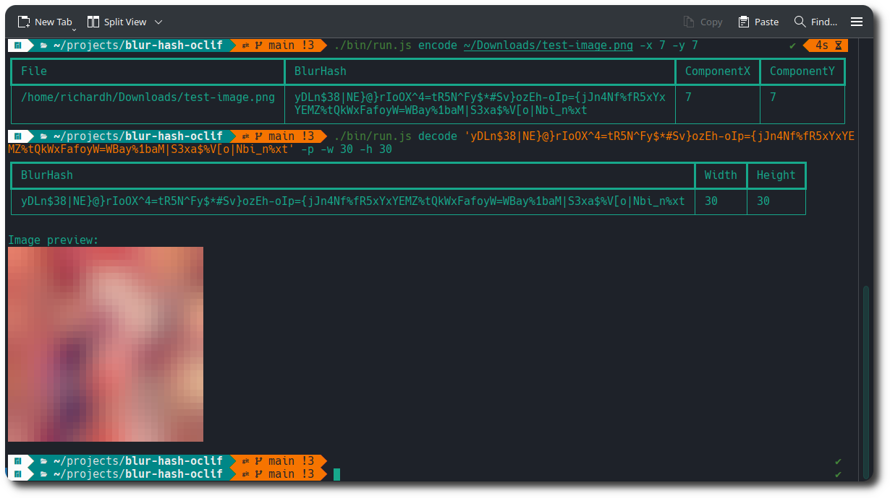

# OCLIF Sharp Blurhash Image-to-Blurhash CLI

This is a Node.js CLI application written in TypeScript that allows you to encode images using blurhash, it leverages the power of oclif, sharp, blurhash, and terminal-image libraries.

## Features

  * Encode images to Blurhash strings
  * Decode Blurhash strings to images
  * Convert an image to it's blurred counterpart
  * Optionally render a terminal-friendly preview of the images created

## Technologies

  * **oclif**: A Node.js framework for building powerful CLIs.
  * **sharp**: High-performance image processing library in Node.js.
  * **blurhash**: Generates compact representations of images for efficient retrieval.
  * **terminal-image**: Renders images directly within the terminal.
  * **mocha & chai**: Unit testing framework and assertion library.

## Usage
```
  $ run.js [COMMAND]

  TOPICS
    plugins  List installed plugins.

  COMMANDS
    convert  convert an image file to a blurred image file
    decode   Decode a given blurhash to an image.
    encode   Encode a given image to its blurhash.
    help     Display help for blur-hash-oclif.
    plugins  List installed plugins.
```
## Screenshot

