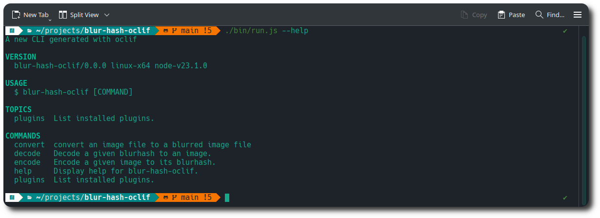

# OCLIF Sharp Blurhash Image-to-Blurhash CLI

 

This is a Node.js CLI application written in TypeScript that allows you to encode images using blurhash, it leverages the power of oclif, sharp, blurhash, and terminal-image libraries.

## Features

  * 📸 Encode images to Blurhash strings
  * 🖼️ Decode Blurhash strings to images
  * 🌫️ Convert an image to its blurred counterpart
  * 🖥️ Optionally render a terminal-friendly preview of the images created

## Technologies

  * **oclif**: A Node.js framework for building powerful CLIs.
  * **sharp**: High-performance image processing library in Node.js.
  * **blurhash**: Generates compact representations of images for efficient retrieval.
  * **terminal-image**: Renders images directly within the terminal.
  * **mocha & chai**: Unit testing framework and assertion library.

## Usage
```
  $ ./run.js [COMMAND]

  TOPICS
    plugins  List installed plugins.

  COMMANDS
    convert  convert an image file to a blurred image file
    decode   Decode a given blurhash to an image.
    encode   Encode a given image to its blurhash.
    help     Display help for blur-hash-oclif.
    plugins  List installed plugins.
```

## Testing

To run tests
```
  $ npm run test
```

## Screenshot




## Aknowledgements

  * [oclif](https://oclif.io/): A Node.js framework for building command-line interfaces.
  * [sharp](https://sharp.pixelplumbing.com/): A high-performance Node.js library for image processing.
  * [blurhash](https://blurhash.com/): A technique for generating compact representations of images.
  * [terminal-image](https://github.com/sindresorhus/terminal-image): A Node.js library for rendering images directly in the terminal.
  * [mocha](https://mochajs.org/): A JavaScript test framework.
  * [chai](https://www.chaijs.com/): A BDD / TDD assertion library for node and the browser that can be paired with any testing framework.